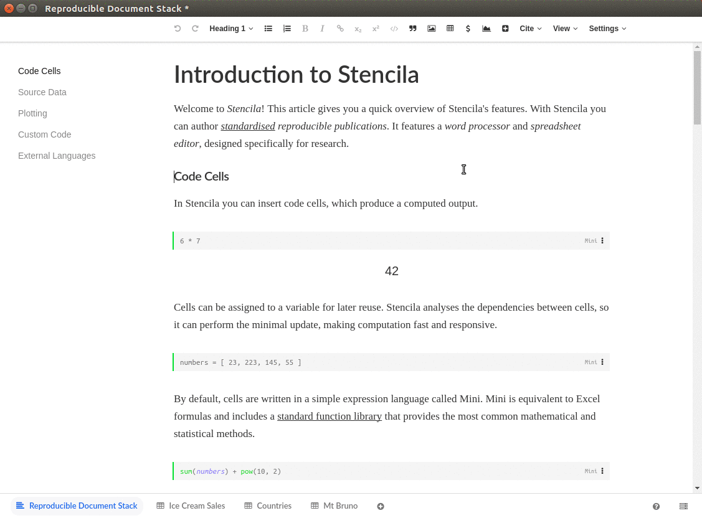

# 💻 Desktop

**Stencila on your desktop**

## ⚠️ Deprecated

This project is deprecated and no longer maintained. Please see, our main repository, [`stencila/stencila`](https://github.com/stencila/stencila), for other projects that provide similar or alternative functionality.

## 👋 Introduction

[Stencila](https://stenci.la) is a platform for reproducible research. One of our aims is to provide intuitive, familiar, visual interfaces for researcher to do reproducible research within. To lower the barriers to entry.

This is the desktop deployment of our web-based "reproducible office suite" with interfaces for editing both textual and spreadsheet documents.

## 🎥 Demo



The above example documents are bundled in the app. See the introductory video [here](https://www.youtube.com/watch?v=EzrR96PDnO8) and other example documents [here](http://builds.stenci.la/stencila/update-the-introduction-rds-example-2018-11-19-db47651/).

## 🚨 Warning

You should only open documents that you trust using Stencila Desktop. Articles and spreadsheets can contain Javascript, Python, and/or R code that will run on your machine. Furthermore, this version on Stencila Desktop uses an old version of Electron which has a [critical vulnerability](https://www.electronjs.org/blog/web-preferences-fix) which may allow remote code execution.

## 📦 Install

Download an installer for the latest release at https://github.com/stencila/desktop/releases

- Windows : `.exe`
- Mac OSX : `.dmg`
- Linux: `.AppImage`

## ⚒️ Develop

To run a development version of Stencila Desktop:

```bash
$ git clone https://github.com/stencila/desktop.git
$ cd desktop
$ npm install
$ npm start
```

To create a distributable binary of Stencila Desktop:

```
$ npm run release
```

Find the binary for your operating system in the `dist` folder.
